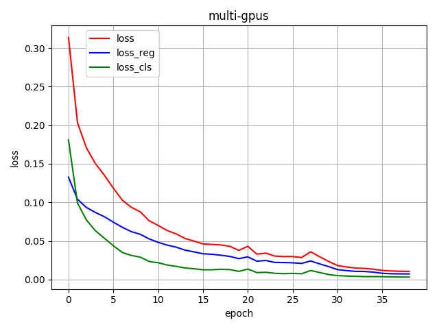
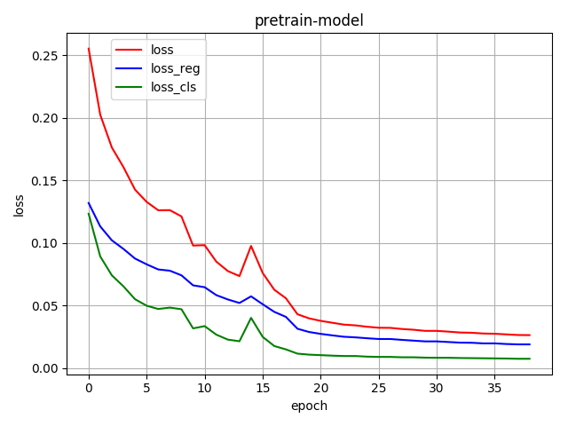
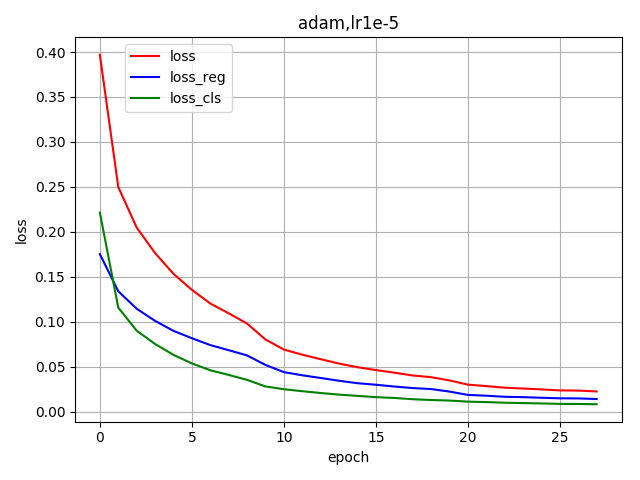

# Pytorch CTPN

集群上装的cuda10.1,tensorflow还不支持,所以只能用pytorch了,本来就想重构一下代码,随便训练一下就ok了,没想到怎么调参数都不收敛,用论文的参数也不行,郁闷至极.
单gpu训练有点慢,就写了下多gpu的,训练是快了,但是不收敛啊.找github上其他复现的代码,发现有好多冗余,而且后的还有bug,最后发现单gpu的用[text-detection-ctpn
](https://github.com/eragonruan/text-detection-ctpn)的参数,终于可以了.感觉写的多gpu的没问题,loss也收敛,但是没效果.

## icdar2017 标注错误数据

```
image_7367.jpg
image_614.jpg
image_769.jpg
image_808.jpg
image_5591.jpg 
image_6089.jpg
image_6124.jpg

- 运行时报错的数据
image_1108.jpg
image_1460.jpg
image_1518.jpg
image_2109.jpg
image_2283.jpg
image_2650.jpg 
image_5156.jpg
```

## 多GPU训练问题



看loss本来以为成了,但是,根本什么都检查不出来,:weary:

## 用别人训练好的模型finetune



用别人训练好的模型,自己finetune一下,可以收敛,也可以检测到.但是,我的自己从训练成功才放心啊.

## Adam 1e-5


这小的学习率,才可以.10个epoch后 lr*0.5